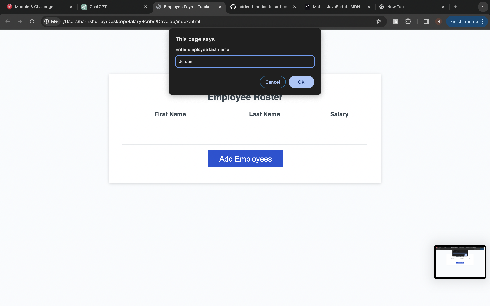
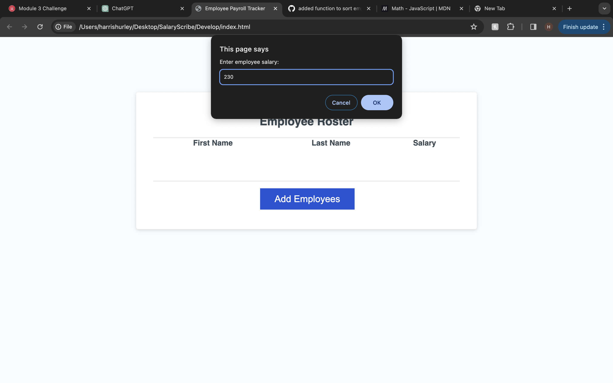
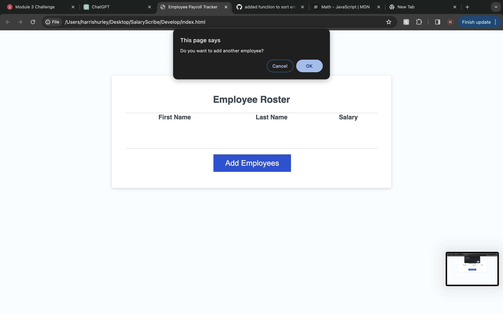
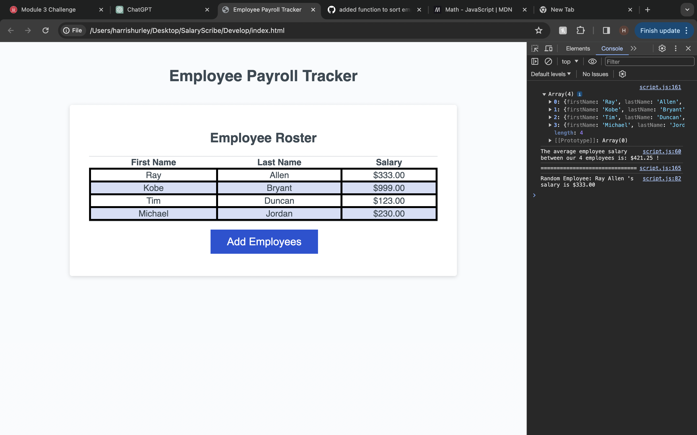

# SalaryScribe

## Description

The Employee Payroll Tracker is a web-based application designed to streamline the management and tracking of employee payroll data. It offers a convenient solution for payroll managers to add, view, and organize employee information efficiently. With its user-friendly interface and responsive design, the Employee Payroll Tracker simplifies the process of managing payroll data, providing a seamless experience for users. It also displays usful data through the console interface, allowing the user to display information such as a selected random employee, and the average salary of all employees.

## Table of Contents (Optional)

- [Installation](#installation)
- [Usage](#usage)
- [Images](#images)
- [Credits](#credits)
- [License](#license)

## Installation

N/A

## Usage

Usage of this site is designed around the the 'Employee Roster' table. In order to add employees to the table you must press the 'Add Employees' button and enter the necessary information (first name, last name, and salary). Furthermore, If you press ==Command+Option+I== (MacOS) or ==Control+Shift+I== (Windows), the console will appear to either the side or bottom of your window. Important info is logged in the console, info such as the array of employees, the average employee salary, and the info of one random employee. If you wish to reset the table, simply refresh the page.

## Images

## Credits

[Xandromus](https://github.com/coding-boot-camp/curly-potato/commits?author=Xandromus): Provided starter code for this project.

[MDN Web Docs](https://developer.mozilla.org/en-US/): Incredably usful docs and all things coding

[ChatGPT](https://chat.openai.com/c/290c33f0-11c4-460e-b422-6ddce4821125): Y'all know exactly why this is here.

[Bro Code](https://www.youtube.com/watch?v=xR82Jx4pqIc): Tutorial for JavaScript math as well as much more.

## License

MIT License

Copyright (c) 2024 harrismhurley

Permission is hereby granted, free of charge, to any person obtaining a copy
of this software and associated documentation files (the "Software"), to deal
in the Software without restriction, including without limitation the rights
to use, copy, modify, merge, publish, distribute, sublicense, and/or sell
copies of the Software, and to permit persons to whom the Software is
furnished to do so, subject to the following conditions:

The above copyright notice and this permission notice shall be included in all
copies or substantial portions of the Software.

THE SOFTWARE IS PROVIDED "AS IS", WITHOUT WARRANTY OF ANY KIND, EXPRESS OR
IMPLIED, INCLUDING BUT NOT LIMITED TO THE WARRANTIES OF MERCHANTABILITY,
FITNESS FOR A PARTICULAR PURPOSE AND NONINFRINGEMENT. IN NO EVENT SHALL THE
AUTHORS OR COPYRIGHT HOLDERS BE LIABLE FOR ANY CLAIM, DAMAGES OR OTHER
LIABILITY, WHETHER IN AN ACTION OF CONTRACT, TORT OR OTHERWISE, ARISING FROM,
OUT OF OR IN CONNECTION WITH THE SOFTWARE OR THE USE OR OTHER DEALINGS IN THE
SOFTWARE.

## Features

- Add Employees: Easily add new employees to the system by entering their first name, last name, and salary.
- Employee Roster: View a comprehensive roster of all employees, including their first name, last name, and salary, presented in a clear and organized table format.
- Dynamic Interaction: Users can interact dynamically with the application, adding new employees as needed and viewing the updated roster instantly.
- Responsive Design: The application is built with responsiveness in mind, ensuring optimal display and functionality across various devices and screen sizes.
- Efficient Management: By providing essential features for payroll management, such as sorting employees alphabetically by last name, the Employee Payroll Tracker enhances efficiency and productivity for payroll managers.
- Average Salary Calculation: The console displays the average salary of all employees, providing valuable insights for budgeting and financial planning.
- Random Employee Selector: Users can randomly select an employee from the roster, providing a quick way to access individual employee data.